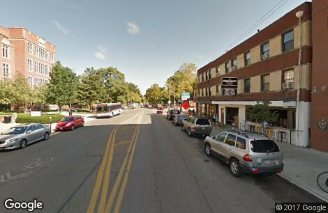

# Object-Detection-via-TensorFlow
This repository shows a simple way to implement sliding window object detection in images via TensorFlow. 

## Prerequisites
* Python
* TensorFlow

#### Set up TensorFlow

Experienced users may prefer to [install TensorFlow manually](https://www.tensorflow.org/install/), and skip this section.
This repository recommends using Docker (see below).

#### Setup Docker

If you don't have docker installed already you can [download the installer here](https://www.docker.com/community-edition).

#### Test your Docker installation
To test your Docker installation try running the following command in the terminal :
```
docker run hello-world
```
This should output some text starting with:
```
Hello from Docker!
This message shows that your installation appears to be working correctly.
...
```
#### Run and Test the TensorFlow Image
Now that you've confirmed that Docker is working, test out the TensorFlow image:
```
docker run -it tensorflow/tensorflow:1.1.0 bash
```
After downloading your prompt should change to root@xxxxxxx:/notebooks#.

Next check to confirm that your TensorFlow installation works by invoking Python from the container's command line:
```
# Your prompt should be "root@xxxxxxx:/notebooks" 
python
```
Once you have a python prompt,``` >>>```, run the following code:
```
# python

import tensorflow as tf
hello = tf.constant('Hello, TensorFlow!')
sess = tf.Session() # It will print some warnings here.
print(sess.run(hello))
```
This should print ```Hello TensorFlow!``` (and a couple of warnings after the tf.Session line).

#### Exit Docker
Now press ```Ctrl-d```, on a blank line, once to exit python, and a second time to exit the docker image.

#### Relaunch Docker

Now create the working directory:
```
mkdir tf_files
```
Then relaunch Docker with that directory shared as your working directory, and port number 6006 published for TensorBoard:
```
docker run -it \
  --publish 6006:6006 \
  --volume ${HOME}/tf_files:/tf_files \
  --workdir /tf_files \
  tensorflow/tensorflow:1.1.0 bash
```
Your prompt will change to ```root@xxxxxxxxx:/tf_files#```

## Retrieve Training Images
In order to train the TensorFlow model, we need to gather some images of different categories. I already gathered some sample images that you can download from this repository. Go ahead to download the folder ```train_images``` and put it under the working directory ```tf_files```. 

You may also gather your own training images. Make sure you place them in folders which labeled with corresponding categories, and do the same as above, put all the folders in the folder ```train_images``` under the working directory ```tf_files```.

## Retrain Inception

The retrain script is part of the tensorflow repo, but it is not installed as part of the pip package. So you need to download it manually, to the current directory (tf_files):
```
curl -O https://raw.githubusercontent.com/tensorflow/tensorflow/r1.1/tensorflow/examples/image_retraining/retrain.py
```
At this point, we have a trainer, we have data, so let's train! We will train the Inception v3 network.

Inception is a huge image classification model with millions of parameters that can differentiate a large number of kinds of images. We're only training the final layer of that network, so training will end in a reasonable amount of time.

Start your image retraining with one big command (note the --summaries_dir option, sending training progress reports to the directory that tensorboard is monitoring) :
```
python retrain.py \
  --bottleneck_dir=bottlenecks \
  --how_many_training_steps=500 \
  --model_dir=inception \
  --summaries_dir=training_summaries/basic \
  --output_graph=retrained_graph.pb \
  --output_labels=retrained_labels.txt \
  --image_dir=train_images
```

This script downloads the pre-trained Inception v3 model, adds a new final layer, and trains that layer on the sample photos you've downloaded.

The above example iterates only 500 times. If you skipped the step where we deleted most of the training data and are training on the full dataset you can very likely get improved results (i.e. higher accuracy) by training for longer. To get this improvement, remove the parameter --how_many_training_steps to use the default 4,000 iterations.

```
python retrain.py \
  --bottleneck_dir=bottlenecks \
  --model_dir=inception \
  --summaries_dir=training_summaries/long \
  --output_graph=retrained_graph.pb \
  --output_labels=retrained_labels.txt \
  --image_dir=train_images
```
More detailed steps and explanation about retraining images can be found [here](https://www.tensorflow.org/tutorials/image_retraining).

## Image Recognition
The retraining script will write out a version of the Inception v3 network with a final layer retrained to your categories to ```tf_files/retrained_graph.pb``` and a text file containing the labels to ```tf_files/retrained_labels.txt```.

These files are both in a format that the [C++ and Python image classification examples](https://www.tensorflow.org/versions/master/tutorials/image_recognition/index.html) can use, so you can start using your new model immediately.

### Classifying an image
Here is a Python script that loads your new graph file and predicts with it.

#### label_image.py
```python
import numpy as np
import tensorflow as tf, sys
from PIL import Image
import io

def classifier(image_data, label_path, retrained_path):
    # Loads label file, strips off carriage return
    label_lines = [line.rstrip() for line 
                       in tf.gfile.GFile(label_path)]

    # Unpersists graph from file
    with tf.gfile.FastGFile(retrained_path, 'rb') as f:
        graph_def = tf.GraphDef()
        graph_def.ParseFromString(f.read())
        _ = tf.import_graph_def(graph_def, name='')

    with tf.Session() as sess:
        # Feed the image_data as input to the graph and get first prediction
        softmax_tensor = sess.graph.get_tensor_by_name('final_result:0')

        predictions = sess.run(softmax_tensor, \
                 {'DecodeJpeg/contents:0': image_data})

        # Sort to show labels of first prediction in order of confidence
        top_k = predictions[0].argsort()[-len(predictions[0]):][::-1]

        for node_id in top_k:
            human_string = label_lines[node_id]
            score = predictions[0][node_id]
            print('%s (score = %.2f)' % (human_string, score))
            
```
#### Define path in your local device
```python
label_path = "/Users/justinwu/tf_files/retrained_labels.txt"
retrained_path = "/Users/justinwu/tf_files/retrained_graph.pb"
```

Let's use the model to try classify a test image:


The following script is to load images and convert them into byte array so that it fits the format of TensorFlow model. Make sure you enter correct directory of the image.
```python
# Load image
img = Image.open('/Users/justinwu/Desktop/test.jpg', mode='r')

# Convert image to Byte array
imgByteArray = io.BytesIO()
img.save(imgByteArray, format='JPEG')
imgByteArray = imgByteArray.getvalue()

# Classify
classifier(imgByteArray,label_path,retrained_path)
```
And the result is:
```
car (score = 0.98)
road (score = 0.01)
building (score = 0.01)
sky (score = 0.00)
tree (score = 0.00)
```
## Object Detection

Up to this point, we are abale to do image recognition using the TensorFlow model, and here we are going to implement sliding window skill in order to accomplish object detection.

We will be using a Google street view picture as an example:


The script is as below:
```python
# change this as you see fit
image_path = '/Users/justinwu/Desktop/test2.jpg'

# Convert image to np.array
image = Image.open(image_path, mode='r')
image_array = np.array(image)

# Sliding window
scale_x = 7
scale_y = 5
y_len,x_len,_ = image_array.shape

for y in range(scale_y):
    for x in range(scale_x):
        print('(%s,%s)' % (x+1, y+1))
        cropped_image = Image.fromarray(image_array[(y*y_len)/scale_y:((y+1)*y_len)/scale_y,
                                      (x*x_len)/scale_x:((x+1)*x_len)/scale_x,:])
        imgByteArray = io.BytesIO()
        cropped_image.save(imgByteArray, format='JPEG')
        imgByteArray = imgByteArray.getvalue()

        # Classify
        classifier(imgByteArray,label_path,retrained_path)
```
You can change the size of the window by adjusting ```scale_x``` and ```scale_y```. 
The model can identify objects according to the images we trained. In this example it classifies 5 categories, and the result highly depends on the images you chose to train. Some identified objects are as below:


```
(3,1)
sky (score = 0.90)
road (score = 0.06)
tree (score = 0.02)
car (score = 0.01)
building (score = 0.01)
```

```
(6,2)
building (score = 0.94)
tree (score = 0.02)
road (score = 0.02)
sky (score = 0.02)
car (score = 0.01)
```

```
(2,3)
tree (score = 0.88)
sky (score = 0.03)
road (score = 0.03)
building (score = 0.03)
car (score = 0.02)
```

```
(6,4)
car (score = 0.93)
building (score = 0.02)
road (score = 0.02)
sky (score = 0.01)
tree (score = 0.01)
```
Overall, the model is pretty accurate on all predictions. Some people might get error when executing the script:
```ValueError: GraphDef cannot be larger than 2GB.```
Click [here](https://stackoverflow.com/questions/36349049/overcome-graphdef-cannot-be-larger-than-2gb-in-tensorflow) for some suggested solutions.
